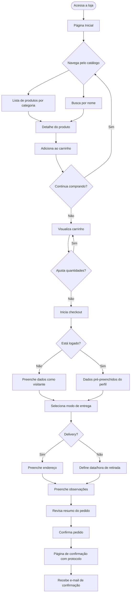
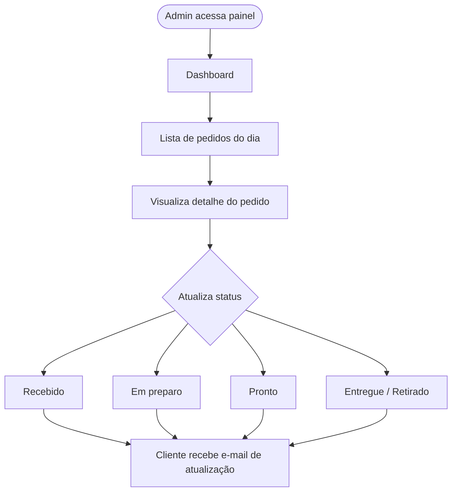
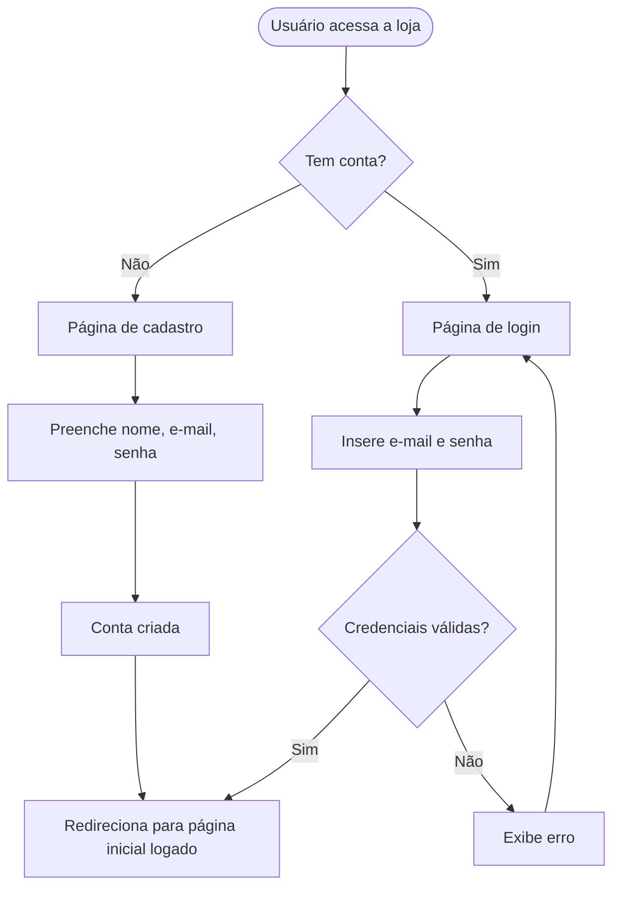
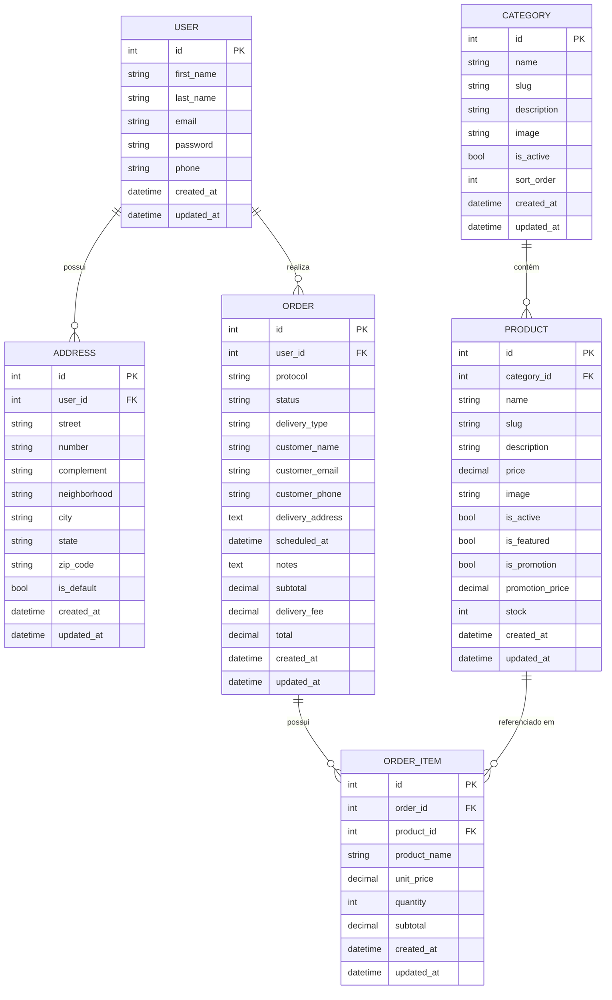

# PRD — Loja Virtual de Confeitaria

---

## 1. Visão Geral

Este documento descreve os requisitos de produto para uma loja virtual de confeitaria artesanal, desenvolvida com Python/Django full stack e TailwindCSS. O sistema permite que clientes naveguem pelo cardápio, montem pedidos personalizados e realizem a compra de produtos como bolos, doces e salgados, com gestão completa pelo painel administrativo da confeitaria.

---

## 2. Sobre o Produto

**Nome provisório:** Confeitaria Virtual  
**Tipo:** E-commerce B2C especializado em confeitaria artesanal  
**Plataforma:** Web responsiva (desktop, tablet e mobile)  
**Stack principal:** Python 3.12 · Django 5.x · SQLite · TailwindCSS 3.x  
**Modo de entrega:** Retirada no local e entrega por delivery (área de cobertura configurável)

O produto é uma loja virtual simples e funcional, sem over engineering, que centraliza o catálogo de produtos, o fluxo de pedidos e a comunicação com o cliente em um único sistema Django full stack.

---

## 3. Propósito

Digitalizar o processo de vendas de uma confeitaria artesanal, eliminando pedidos por WhatsApp/telefone com agendas manuais, reduzindo erros operacionais e oferecendo ao cliente uma experiência de compra clara, bonita e intuitiva, mesmo em dispositivos móveis.

---

## 4. Público-Alvo

| Perfil | Descrição |
|---|---|
| **Cliente final** | Adultos de 25–55 anos, região local/delivery, com acesso a smartphone ou computador, que buscam bolos e doces para ocasiões especiais ou consumo rotineiro |
| **Administrador** | Proprietário ou funcionário da confeitaria, com baixo conhecimento técnico, que precisa gerenciar catálogo, pedidos e status sem depender de desenvolvedores |

---

## 5. Objetivos

### 5.1 Objetivos de Negócio
- Aumentar o volume de pedidos ao facilitar o processo de compra online
- Reduzir o tempo gasto com atendimento manual via WhatsApp
- Centralizar o controle de pedidos em um único painel

### 5.2 Objetivos de Produto
- Entregar um catálogo de produtos navegável e filtrável por categoria
- Implementar fluxo de carrinho → checkout → confirmação de pedido
- Disponibilizar painel administrativo para gestão de produtos e pedidos
- Garantir design responsivo e moderno com identidade visual de confeitaria

### 5.3 Objetivos Técnicos
- Código simples, legível e aderente à PEP 8
- Django full stack sem frameworks JS externos
- Zero dependência de Docker na fase inicial
- Banco de dados SQLite nativo do Django

---

## 6. Requisitos Funcionais

### 6.1 Módulo de Catálogo
- RF01 — Listar produtos por categoria (bolos, doces, salgados, bebidas)
- RF02 — Exibir página de detalhe do produto com foto, descrição, preço e opções de personalização
- RF03 — Filtrar produtos por categoria e busca por nome
- RF04 — Destacar produtos em promoção e mais vendidos

### 6.2 Módulo de Carrinho
- RF05 — Adicionar/remover produtos ao carrinho (sessão Django)
- RF06 — Alterar quantidade de itens no carrinho
- RF07 — Exibir subtotal, frete estimado e total
- RF08 — Persistir carrinho na sessão sem exigir login

### 6.3 Módulo de Checkout
- RF09 — Formulário de dados do cliente (nome, telefone, e-mail)
- RF10 — Seleção de modo de entrega: retirada ou delivery
- RF11 — Campo de endereço condicional (apenas para delivery)
- RF12 — Campo de observações/personalizações do pedido
- RF13 — Seleção de data/hora desejada para retirada ou entrega
- RF14 — Resumo do pedido antes da confirmação
- RF15 — Confirmação de pedido com número de protocolo

### 6.4 Módulo de Autenticação
- RF16 — Cadastro e login de clientes (e-mail + senha)
- RF17 — Histórico de pedidos para clientes logados
- RF18 — Edição de perfil e endereços salvos

### 6.5 Módulo Administrativo
- RF19 — CRUD de categorias de produtos
- RF20 — CRUD de produtos (nome, descrição, foto, preço, estoque, destaque, ativo)
- RF21 — Listagem de pedidos com filtro por status e data
- RF22 — Atualização de status do pedido (Recebido → Em preparo → Pronto → Entregue)
- RF23 — Visualização do detalhe de cada pedido
- RF24 — Dashboard com resumo do dia (total de pedidos, receita, pedidos pendentes)

### 6.6 Módulo de Notificações
- RF25 — E-mail de confirmação de pedido ao cliente
- RF26 — E-mail de atualização de status ao cliente

---

### 6.7 Fluxos de UX — Flowcharts

#### Fluxo do Cliente — Compra



#### Fluxo do Administrador — Gestão de Pedidos



#### Fluxo de Autenticação



---

## 7. Requisitos Não-Funcionais

| ID | Categoria | Requisito |
|---|---|---|
| RNF01 | Código | Aderência à PEP 8; aspas simples; código em inglês |
| RNF02 | Código | Class Based Views preferencialmente; sem over engineering |
| RNF03 | Banco de dados | SQLite nativo do Django; todo model com `created_at` e `updated_at` |
| RNF04 | Frontend | Django Template Language + TailwindCSS; sem frameworks JS externos |
| RNF05 | UI | Design responsivo (mobile-first); gradientes harmônicos |
| RNF06 | UI | Toda interface em português brasileiro |
| RNF07 | Segurança | CSRF protection nativo do Django; senhas com hash via `AbstractUser` |
| RNF08 | Signals | Signals em arquivo `signals.py` dentro da app correspondente |
| RNF09 | Infra | Sem Docker na fase inicial |
| RNF10 | Testes | Sem testes na fase inicial (sprints finais) |
| RNF11 | Performance | Páginas carregando em menos de 2s em conexão 4G |
| RNF12 | Manutenção | Admin padrão do Django extendido para gestão operacional |

---

## 8. Arquitetura Técnica

### 8.1 Stack

| Camada | Tecnologia |
|---|---|
| Linguagem | Python 3.12 |
| Framework web | Django 5.x |
| Banco de dados | SQLite (django.db.backends.sqlite3) |
| Frontend | Django Template Language + TailwindCSS 3.x (via CLI standalone) |
| E-mail | Django `send_mail` com SMTP configurável (Gmail/Mailtrap) |
| Armazenamento de mídia | Django `FileField` / `ImageField` com `MEDIA_ROOT` local |
| Ambiente | `python-decouple` para variáveis de ambiente via `.env` |
| Dependências | `Pillow` (imagens), `django-widget-tweaks` (formulários) |

### 8.2 Estrutura de Apps Django

```
confeitaria/           ← projeto Django (settings, urls, wsgi)
├── core/              ← app base: home, páginas estáticas, contexto global
├── catalog/           ← categorias e produtos
├── cart/              ← carrinho via sessão
├── orders/            ← pedidos, itens de pedido, status
├── accounts/          ← cadastro, login, perfil, endereços
└── dashboard/         ← painel administrativo customizado
```

### 8.3 Estrutura de Dados — Schema ER



---

## 9. Design System

### 9.1 Paleta de Cores

Paleta inspirada em confeitaria artesanal: tons rosados, cremes aquecidos, chocolates e dourados.

| Token | Nome | Hex | Uso |
|---|---|---|---|
| `primary-50` | Rosa Pétala | `#FFF1F3` | Fundos suaves |
| `primary-100` | Rosa Creme | `#FFE4E8` | Cards, hover suave |
| `primary-400` | Rosa Vibrante | `#FB7185` | Destaques, badges |
| `primary-500` | Rosa Principal | `#F43F5E` | Botão primário, links ativos |
| `primary-600` | Rosa Escuro | `#E11D48` | Hover botão primário |
| `secondary-400` | Caramelo Claro | `#FBBF24` | Badges promoção, ícones |
| `secondary-500` | Dourado | `#F59E0B` | Destaque premium |
| `brown-600` | Chocolate | `#92400E` | Texto secundário, bordas |
| `brown-800` | Cacau | `#451A03` | Texto em fundos claros |
| `neutral-50` | Creme Off-White | `#FAFAF9` | Background geral |
| `neutral-100` | Creme Suave | `#F5F5F4` | Background de seções |
| `neutral-600` | Cinza Médio | `#57534E` | Texto corpo |
| `neutral-900` | Quase Preto | `#1C1917` | Títulos |

### 9.2 Gradientes

```html
<!-- Gradiente hero principal -->
<div class="bg-gradient-to-br from-rose-50 via-pink-100 to-rose-200">

<!-- Gradiente botão primário -->
<button class="bg-gradient-to-r from-rose-500 to-pink-600 hover:from-rose-600 hover:to-pink-700">

<!-- Gradiente card destaque -->
<div class="bg-gradient-to-br from-amber-50 to-rose-50">

<!-- Gradiente header/navbar -->
<nav class="bg-gradient-to-r from-rose-700 via-pink-600 to-rose-500">
```

### 9.3 Tipografia

```html
<!-- Fonte: Google Fonts via link no base.html -->
<!-- Títulos: Playfair Display (serif elegante) -->
<!-- Corpo: Inter (sans-serif legível) -->

<link rel="preconnect" href="https://fonts.googleapis.com">
<link href="https://fonts.googleapis.com/css2?family=Playfair+Display:wght@400;600;700&family=Inter:wght@300;400;500;600&display=swap" rel="stylesheet">
```

```html
<!-- Título de página -->
<h1 class="font-['Playfair_Display'] text-3xl md:text-4xl font-bold text-neutral-900">

<!-- Título de seção -->
<h2 class="font-['Playfair_Display'] text-2xl font-semibold text-neutral-800">

<!-- Texto corpo -->
<p class="font-['Inter'] text-base text-neutral-600 leading-relaxed">

<!-- Label e caption -->
<span class="font-['Inter'] text-sm font-medium text-neutral-500">
```

### 9.4 Botões

```html
<!-- Botão Primário -->
<button class="bg-gradient-to-r from-rose-500 to-pink-600 hover:from-rose-600 hover:to-pink-700
               text-white font-medium px-6 py-3 rounded-xl shadow-md
               hover:shadow-lg transition-all duration-200 cursor-pointer">
  Adicionar ao Carrinho
</button>

<!-- Botão Secundário (outline) -->
<button class="border-2 border-rose-500 text-rose-600 hover:bg-rose-50
               font-medium px-6 py-3 rounded-xl transition-all duration-200 cursor-pointer">
  Ver Detalhes
</button>

<!-- Botão Ghost -->
<button class="text-rose-600 hover:text-rose-700 hover:bg-rose-50
               font-medium px-4 py-2 rounded-lg transition-all duration-200 cursor-pointer">
  Cancelar
</button>

<!-- Botão Perigo -->
<button class="bg-red-500 hover:bg-red-600 text-white
               font-medium px-4 py-2 rounded-lg transition-all duration-200 cursor-pointer">
  Remover
</button>

<!-- Botão Admin / Ação administrativa -->
<button class="bg-gradient-to-r from-amber-400 to-amber-500 hover:from-amber-500 hover:to-amber-600
               text-white font-medium px-5 py-2.5 rounded-lg shadow-sm
               transition-all duration-200 cursor-pointer">
  Salvar Produto
</button>
```

### 9.5 Inputs e Formulários

```html
<!-- Input padrão -->
<div class="flex flex-col gap-1">
  <label class="text-sm font-medium text-neutral-700">Nome completo</label>
  <input type="text"
         class="w-full px-4 py-3 rounded-xl border border-neutral-200
                bg-white focus:outline-none focus:ring-2 focus:ring-rose-400
                focus:border-transparent placeholder-neutral-400
                text-neutral-800 transition-all duration-200"
         placeholder="Digite seu nome">
</div>

<!-- Input com erro (django-widget-tweaks ou classe condicional) -->
<input type="text"
       class="w-full px-4 py-3 rounded-xl border border-red-400
              bg-red-50 focus:outline-none focus:ring-2 focus:ring-red-400
              text-neutral-800 transition-all duration-200">
<span class="text-xs text-red-500 mt-1">Este campo é obrigatório.</span>

<!-- Select -->
<select class="w-full px-4 py-3 rounded-xl border border-neutral-200
               bg-white focus:outline-none focus:ring-2 focus:ring-rose-400
               text-neutral-800 cursor-pointer transition-all duration-200">
  <option>Selecione uma categoria</option>
</select>

<!-- Textarea -->
<textarea rows="4"
          class="w-full px-4 py-3 rounded-xl border border-neutral-200
                 bg-white focus:outline-none focus:ring-2 focus:ring-rose-400
                 text-neutral-800 resize-none transition-all duration-200">
</textarea>
```

### 9.6 Cards de Produto

```html
<!-- Card de produto -->
<div class="bg-white rounded-2xl shadow-sm hover:shadow-md border border-neutral-100
            overflow-hidden transition-all duration-200 group">
  <div class="relative overflow-hidden">
    
    
    <span class="absolute top-3 left-3 bg-amber-400 text-white text-xs font-semibold px-2 py-1 rounded-full">
      Promoção
    </span>
    
    
    <span class="absolute top-3 right-3 bg-rose-500 text-white text-xs font-semibold px-2 py-1 rounded-full">
      Destaque
    </span>
    
  </div>
  <div class="p-4">
    <h3 class="font-['Playfair_Display'] font-semibold text-neutral-900 text-lg">{{ product.name }}</h3>
    <p class="text-sm text-neutral-500 mt-1 line-clamp-2">{{ product.description }}</p>
    <div class="flex items-center justify-between mt-4">
      <span class="text-rose-600 font-bold text-xl">R$ {{ product.price }}</span>
      <button class="bg-gradient-to-r from-rose-500 to-pink-600 text-white
                     text-sm font-medium px-4 py-2 rounded-xl hover:shadow-md
                     transition-all duration-200 cursor-pointer">
        Adicionar
      </button>
    </div>
  </div>
</div>
```

### 9.7 Navbar

```html
<nav class="bg-gradient-to-r from-rose-700 via-pink-600 to-rose-500 shadow-lg sticky top-0 z-50">
  <div class="max-w-7xl mx-auto px-4 sm:px-6 lg:px-8">
    <div class="flex items-center justify-between h-16">
      <!-- Logo -->
      <a href="" class="font-['Playfair_Display'] text-white text-2xl font-bold">
        🎂 Confeitaria
      </a>
      <!-- Links desktop -->
      <div class="hidden md:flex items-center gap-6">
        <a href="" class="text-rose-100 hover:text-white font-medium transition-colors">
          Cardápio
        </a>
        <!-- Carrinho -->
        <a href="" class="relative text-white">
          <span class="text-xl">🛒</span>
          <span class="absolute -top-2 -right-2 bg-amber-400 text-white text-xs rounded-full w-5 h-5
                       flex items-center justify-center font-bold">
            {{ cart_count }}
          </span>
        </a>
      </div>
    </div>
  </div>
</nav>
```

### 9.8 Grid de Produtos

```html
<!-- Grid responsivo de produtos -->
<div class="grid grid-cols-1 sm:grid-cols-2 lg:grid-cols-3 xl:grid-cols-4 gap-6">
  
    
  
</div>
```

### 9.9 Badges de Status de Pedido

```html
<!-- Status badges -->

  <span class="bg-blue-100 text-blue-700 text-xs font-semibold px-3 py-1 rounded-full">Recebido</span>

  <span class="bg-amber-100 text-amber-700 text-xs font-semibold px-3 py-1 rounded-full">Em preparo</span>

  <span class="bg-green-100 text-green-700 text-xs font-semibold px-3 py-1 rounded-full">Pronto</span>

  <span class="bg-neutral-100 text-neutral-600 text-xs font-semibold px-3 py-1 rounded-full">Entregue</span>

```

---

## 10. User Stories

### Épico 1 — Catálogo de Produtos

| ID | Como... | Quero... | Para... |
|---|---|---|---|
| US01 | Cliente | Ver todos os produtos organizados por categoria | Encontrar facilmente o que desejo |
| US02 | Cliente | Visualizar foto, descrição e preço detalhados de um produto | Tomar decisão de compra informada |
| US03 | Cliente | Filtrar produtos por categoria e buscar por nome | Agilizar minha navegação |
| US04 | Cliente | Ver produtos em destaque e promoções na página inicial | Não perder ofertas especiais |

**Critérios de aceite — US01:**
- [ ] Página de catálogo exibe todos os produtos ativos
- [ ] Filtro por categoria funciona via GET param `?categoria=slug`
- [ ] Busca por nome funciona via GET param `?q=termo`
- [ ] Produtos inativos não aparecem para o cliente
- [ ] Grid é responsivo (1 col mobile, 2 tablet, 3-4 desktop)

**Critérios de aceite — US02:**
- [ ] Página de detalhe exibe imagem, nome, descrição completa e preço
- [ ] Se produto em promoção, exibe preço original riscado e preço promocional
- [ ] Botão "Adicionar ao carrinho" presente e funcional
- [ ] Exibe categoria do produto com link de volta ao catálogo

---

### Épico 2 — Carrinho de Compras

| ID | Como... | Quero... | Para... |
|---|---|---|---|
| US05 | Cliente | Adicionar produtos ao carrinho sem precisar fazer login | Comprar de forma ágil |
| US06 | Cliente | Ajustar quantidades e remover itens do carrinho | Revisar meu pedido antes de confirmar |
| US07 | Cliente | Ver o resumo do carrinho com subtotal e total | Saber quanto estou gastando |

**Critérios de aceite — US05:**
- [ ] Carrinho persiste na sessão Django sem necessidade de login
- [ ] Adicionar o mesmo produto incrementa a quantidade
- [ ] Ícone na navbar exibe contagem de itens no carrinho
- [ ] Feedback visual (mensagem) ao adicionar item

**Critérios de aceite — US06:**
- [ ] Botões + e − ajustam quantidade; ao chegar em 0, item é removido
- [ ] Botão "Remover" exclui o item diretamente
- [ ] Total é recalculado em tempo real após cada alteração

---

### Épico 3 — Checkout e Pedido

| ID | Como... | Quero... | Para... |
|---|---|---|---|
| US08 | Cliente | Finalizar a compra informando meus dados | Receber meu pedido corretamente |
| US09 | Cliente | Escolher entre retirada e delivery | Adequar à minha necessidade |
| US10 | Cliente | Adicionar observações ao pedido | Personalizar meu bolo ou produto |
| US11 | Cliente | Receber confirmação por e-mail | Ter comprovante do pedido |

**Critérios de aceite — US08:**
- [ ] Formulário de checkout com nome, e-mail e telefone obrigatórios
- [ ] Validação de campos com mensagens de erro em português
- [ ] Se logado, dados do perfil são pré-preenchidos

**Critérios de aceite — US09:**
- [ ] Campo de endereço aparece apenas quando "Delivery" é selecionado
- [ ] Campo de data/hora agendada é obrigatório em ambos os modos
- [ ] Frete é exibido (pode ser valor fixo ou "a combinar")

**Critérios de aceite — US11:**
- [ ] E-mail enviado com protocolo, itens, total e observações
- [ ] Página de confirmação exibe número de protocolo único
- [ ] Protocolo é gerado automaticamente (UUID curto ou sequencial)

---

### Épico 4 — Autenticação e Perfil

| ID | Como... | Quero... | Para... |
|---|---|---|---|
| US12 | Cliente | Me cadastrar com e-mail e senha | Ter acesso ao histórico de pedidos |
| US13 | Cliente | Fazer login e logout | Acessar minha conta com segurança |
| US14 | Cliente | Ver meu histórico de pedidos | Acompanhar pedidos passados |
| US15 | Cliente | Editar meus dados e endereços | Manter informações atualizadas |

**Critérios de aceite — US12:**
- [ ] Formulário de cadastro valida e-mail único e senha com confirmação
- [ ] Após cadastro, usuário é logado automaticamente e redirecionado para home
- [ ] Senhas armazenadas com hash via Django AbstractUser

**Critérios de aceite — US14:**
- [ ] Lista de pedidos ordenada por data (mais recente primeiro)
- [ ] Cada pedido exibe protocolo, data, total e status
- [ ] Link para detalhe de cada pedido

---

### Épico 5 — Painel Administrativo

| ID | Como... | Quero... | Para... |
|---|---|---|---|
| US16 | Admin | Cadastrar e editar produtos com foto | Manter o cardápio atualizado |
| US17 | Admin | Gerenciar categorias | Organizar o catálogo |
| US18 | Admin | Ver todos os pedidos do dia com status | Controlar a produção |
| US19 | Admin | Atualizar o status de um pedido | Informar o cliente sobre o andamento |
| US20 | Admin | Ver dashboard com resumo do dia | Ter visão rápida do negócio |

**Critérios de aceite — US16:**
- [ ] Formulário de produto com upload de imagem funcional
- [ ] Campos de preço promocional aparecem ao marcar "Em promoção"
- [ ] Produto inativo não aparece no catálogo público

**Critérios de aceite — US18:**
- [ ] Listagem de pedidos filtrável por status e data
- [ ] Cada linha exibe: protocolo, cliente, total, modo de entrega, status
- [ ] Pedidos novos destacados visualmente

**Critérios de aceite — US20:**
- [ ] Cards com: total de pedidos hoje, receita do dia, pedidos pendentes, pedidos prontos
- [ ] Acesso restrito a usuários `is_staff = True`

---

## 11. Métricas de Sucesso

### 11.1 KPIs de Negócio

| KPI | Meta inicial | Como medir |
|---|---|---|
| Pedidos via plataforma por mês | ≥ 50 pedidos/mês | Contagem de `Order` com status ≠ cancelado |
| Taxa de conversão (visitante → pedido) | ≥ 15% | Sessões únicas / pedidos finalizados |
| Ticket médio por pedido | ≥ R$ 80,00 | Média de `Order.total` |
| Receita mensal registrada | Crescimento mês a mês | Soma de `Order.total` por mês |

### 11.2 KPIs de Produto

| KPI | Meta | Como medir |
|---|---|---|
| Tempo médio de checkout | < 3 minutos | Análise de fluxo (tempo entre acesso ao cart e confirmação) |
| Taxa de abandono de carrinho | < 40% | Carrinhos criados vs. pedidos finalizados |
| Produtos mais acessados | Top 5 por semana | Contagem de acessos à página de detalhe |

### 11.3 KPIs de Operação

| KPI | Meta | Como medir |
|---|---|---|
| Tempo de atualização de status | < 30 min após preparo | Diferença entre `created_at` e última atualização de status |
| Taxa de pedidos sem observações problemáticas | > 90% | Feedback manual da operação |
| Uptime da aplicação | > 99% | Monitoramento de disponibilidade |

---

## 12. Riscos e Mitigações

| # | Risco | Probabilidade | Impacto | Mitigação |
|---|---|---|---|---|
| R01 | Fluxo de e-mail não funcionar em produção | Média | Alto | Usar Mailtrap em dev; documentar config SMTP para produção |
| R02 | Upload de imagens sem tamanho limite causando lentidão | Média | Médio | Validar tamanho máximo no model (`Pillow`) e template |
| R03 | Sessão do carrinho expirar antes do checkout | Baixa | Médio | Configurar `SESSION_COOKIE_AGE` adequado (ex: 7 dias) |
| R04 | Admin sem permissão acessando dashboard customizado | Baixa | Alto | Mixins `LoginRequiredMixin` + verificação `is_staff` em todas as views do dashboard |
| R05 | SQLite não suportar concorrência em alta carga | Baixa (fase inicial) | Alto | Aceitável para MVP; migração para PostgreSQL planejada em sprint final |
| R06 | Imagens armazenadas localmente se perderem no deploy | Média | Alto | Documentar backup de `MEDIA_ROOT`; migração para S3 em sprint futuro |
| R07 | TailwindCSS via CDN em produção (sem purge) | Alta | Médio | Usar TailwindCSS CLI standalone com build e purge configurados |

---

*Documento gerado em: 27/04/2026*  
*Versão: 1.0*
